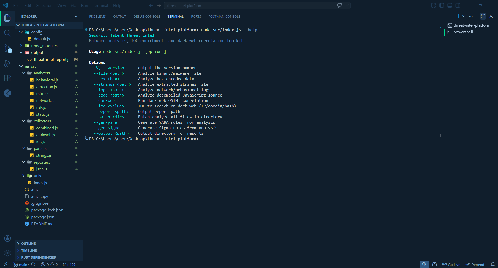

# Security Talent Threat Intel

Security Talent Threat Intel is a Node.js command-line toolkit for malware triage, IOC enrichment, dark web correlation, and detection-content generation. It supports binary samples, JavaScript payloads, extracted strings, JSON logs, batch directories, and standalone IOCs such as hashes, IPs, domains, and URLs.

## Proof of Concept



The platform combines:

- Static analysis
- Behavioral heuristics
- Network IOC extraction
- MITRE ATT&CK mapping
- Risk scoring
- YARA and Sigma generation
- Optional Tor-backed dark web correlation
- JSON, text-summary, and STIX 2.1 style reporting

## Requirements

- Node.js 18 or later
- npm
- Optional Tor service for onion lookups
- Optional API keys for external enrichment

## Installation

```bash
npm install
```

Create a local environment file:

```env
TOR_PROXY=socks5h://127.0.0.1:9050
TOR_TIMEOUT=30000
ABUSEIPDB_KEY=
VT_KEY=
SHODAN_KEY=
URLSCAN_KEY=
FLARE_API_KEY=
FLARE_TENANT_ID=
FLARE_SEARCH_SIZE=5
```

Project already loads these values from [.env](/C:/Users/user/Desktop/threat-intel-platform/.env) through [config/default.js](/C:/Users/user/Desktop/threat-intel-platform/config/default.js).

## Project Structure

```text
threat-intel-platform/
|-- config/
|   `-- default.js
|-- src/
|   |-- analyzers/
|   |   |-- behavioral.js
|   |   |-- detection.js
|   |   |-- mitre.js
|   |   |-- network.js
|   |   |-- risk.js
|   |   `-- static.js
|   |-- collectors/
|   |   |-- combined.js
|   |   |-- darkweb.js
|   |   `-- ioc.js
|   |-- parsers/
|   |   `-- strings.js
|   |-- reporters/
|   |   `-- json.js
|   |-- utils/
|   |   |-- crypto.js
|   |   |-- entropy.js
|   |   `-- patterns.js
|   `-- index.js
|-- package.json
`-- README.md
```

## Configuration

[config/default.js](/C:/Users/user/Desktop/threat-intel-platform/config/default.js) controls:

- Tor proxy host, timeout, and retry settings
- Configured onion search engines
- Configured clear-web enrichment endpoints
- API key loading from environment variables
- Flare API tenant and result-size settings
- Entropy and string extraction thresholds

## CLI Reference

Main entry point:

```bash
node src/index.js [options]
```

Help:

```bash
node src/index.js --help
```

### Input Options

| Option | Purpose | Example |
|---|---|---|
| `--file <path>` | Analyze a binary or generic file payload | `node src/index.js --file ./sample.bin` |
| `--hex <hex>` | Analyze hex-decoded content | `node src/index.js --hex 4D5A9000` |
| `--strings <path>` | Analyze a text file containing extracted strings | `node src/index.js --strings ./strings.txt` |
| `--logs <path>` | Analyze JSON logs or network telemetry | `node src/index.js --logs ./network.json` |
| `--code <path>` | Analyze JavaScript or decompiled source | `node src/index.js --code ./sample.js` |
| `--batch <dir>` | Analyze every file in a directory | `node src/index.js --batch ./samples` |
| `--ioc <value>` | Run IOC-only lookup for hash, IP, domain, or URL | `node src/index.js --darkweb --ioc 2156...2a0c` |

### Output and Enrichment Options

| Option | Purpose | Example |
|---|---|---|
| `--darkweb` | Enable OSINT and onion-source correlation | `node src/index.js --darkweb --ioc 142.11.206.73` |
| `--report <path>` | Write JSON report to a custom path | `node src/index.js --file ./sample.bin --report ./output/report.json` |
| `--output <path>` | Choose output directory | `node src/index.js --file ./sample.bin --output ./output` |
| `--gen-yara` | Export generated YARA rule | `node src/index.js --file ./sample.bin --gen-yara` |
| `--gen-sigma` | Export generated Sigma rule | `node src/index.js --file ./sample.bin --gen-sigma` |

## Command Usage

### 1. Analyze a File

```bash
node src/index.js --file ./sample.bin
```

### 2. Analyze Hex Input

```bash
node src/index.js --hex 4D5A9000
```

### 3. Analyze Extracted Strings

```bash
node src/index.js --strings ./strings.txt
```

### 4. Analyze JSON Logs

```bash
node src/index.js --logs ./network.json
```

### 5. Analyze JavaScript Source

```bash
node src/index.js --code ./sample.js
```

### 6. Analyze a Directory in Batch Mode

```bash
node src/index.js --batch ./samples
```

### 7. IOC Lookup by Malware Hash

```bash
node src/index.js --darkweb --ioc 2156c504f8b4ddc6d2760a0c989c31c93d53b85252d14095cebcadcbe3772a0c
```

### 8. IOC Lookup by IP

```bash
node src/index.js --darkweb --ioc 142.11.206.73
```

### 9. IOC Lookup by Domain

```bash
node src/index.js --darkweb --ioc sfrclak.com
```

### 10. IOC Lookup by URL

```bash
node src/index.js --darkweb --ioc https://evil.example.com/payload
```

### 11. Custom Report Path

```bash
node src/index.js --file ./sample.bin --report ./output/report.json
```

### 12. Generate YARA and Sigma

```bash
node src/index.js --file ./sample.bin --gen-yara --gen-sigma
```

### 13. Full Example

```bash
node src/index.js --code ./sample.js --darkweb --gen-yara --gen-sigma --output ./output
```

## npm Script Usage

Use `npm.cmd` on Windows PowerShell if `npm` is blocked by execution policy.

### Helper Scripts

| Script | Purpose | Usage |
|---|---|---|
| `npm.cmd run cli:help` | Show CLI help | `npm.cmd run cli:help` |
| `npm.cmd run analyze:file -- <path>` | File analysis wrapper | `npm.cmd run analyze:file -- .\\sample.bin` |
| `npm.cmd run analyze:hex -- <hex>` | Hex analysis wrapper | `npm.cmd run analyze:hex -- 4D5A9000` |
| `npm.cmd run analyze:strings -- <path>` | Strings analysis wrapper | `npm.cmd run analyze:strings -- .\\strings.txt` |
| `npm.cmd run analyze:logs -- <path>` | Logs analysis wrapper | `npm.cmd run analyze:logs -- .\\network.json` |
| `npm.cmd run analyze:code -- <path>` | Code analysis wrapper | `npm.cmd run analyze:code -- .\\sample.js` |
| `npm.cmd run analyze:batch -- <dir>` | Batch analysis wrapper | `npm.cmd run analyze:batch -- .\\samples` |
| `npm.cmd run ioc:search -- --ioc <value>` | IOC-only lookup wrapper | `npm.cmd run ioc:search -- --ioc 2156...2a0c` |
| `npm.cmd run darkweb:search -- --ioc <value>` | IOC lookup with dark web flag | `npm.cmd run darkweb:search -- --ioc sfrclak.com` |
| `npm.cmd run report -- --file <path> --report <path>` | Generic reporting wrapper | `npm.cmd run report -- --file .\\sample.bin --report .\\output\\report.json` |
| `npm.cmd run generate:yara -- --file <path>` | Generate YARA output | `npm.cmd run generate:yara -- --file .\\sample.bin` |
| `npm.cmd run generate:sigma -- --file <path>` | Generate Sigma output | `npm.cmd run generate:sigma -- --file .\\sample.bin` |

## Analysis Pipeline

[src/index.js](/C:/Users/user/Desktop/threat-intel-platform/src/index.js) runs the following stages:

1. Input loading
2. Static analysis
3. Behavioral analysis
4. Network intelligence
5. IOC extraction
6. MITRE ATT&CK mapping
7. Risk assessment
8. Detection rule generation
9. Optional dark web correlation
10. Recommendation generation
11. JSON report output

[src/collectors/combined.js](/C:/Users/user/Desktop/threat-intel-platform/src/collectors/combined.js) exposes a reusable orchestration flow for programmatic use.

## Output Files

Default output directory: `./output`

Generated files may include:

- `threat_intel_report.json`
- `generated_rule.yara`
- `generated_rule_sigma.yml`
- Timestamped JSON report from the reporter module
- Timestamped summary text report
- Timestamped STIX 2.1 bundle
- `batch_report.json` for batch mode

## Dark Web and Enrichment Sources

## Backend Flow for Dark Web Sources

The dark web and clear-web backend is driven by the `darkweb` object in [config/default.js](/C:/Users/user/Desktop/threat-intel-platform/config/default.js) and executed by [src/collectors/darkweb.js](/C:/Users/user/Desktop/threat-intel-platform/src/collectors/darkweb.js).

### How the Backend Uses `darkweb.engines`

`darkweb.engines` is a dictionary of onion search endpoints. When `--darkweb` is enabled, the backend:

1. Creates a SOCKS proxy agent using `TOR_PROXY`
2. Iterates over the IOC targets supplied by the user or derived from analysis
3. Sends search requests to the configured onion engines through Tor
4. Stops after a small number of onion attempts per target to avoid excessive delay
5. Extracts:
   - direct IOC mentions
   - `.onion` links
   - short text context around matches
6. Stores results in:
   - `sources_used`
   - `mentions_found`
   - `onion_links`

In code, the relevant flow is:

- `DarkWebCollector.search(targets)`
- `DarkWebCollector.searchOnionEngines(target, results, agent)`

Each onion engine is queried using a URL pattern like:

```text
<engine>/search?query=<ioc>
```

The response body is scanned for:

- the IOC string itself
- any `.onion` addresses
- nearby context snippets for reporting

### How the Backend Uses `darkweb.clearweb`

`darkweb.clearweb` defines the external API endpoints used for non-onion enrichment:

- `abuseipdb`
- `urlscan`
- `virustotal`
- `shodan`
- `flare`

These are consumed selectively by the backend:

- `searchAbuseIPDB()` for IP reputation
- `searchShodan()` for IP exposure, DNS records, and resolved-host summaries
- `searchUrlscan()` for scan history and domain/URL visibility
- `searchVirusTotal()` for hash reputation
- `searchFlare()` for global event search and leak/event correlation

### Backend Execution Order

For each IOC target, the backend currently runs in this order:

1. AbuseIPDB
2. Shodan
3. URLScan
4. VirusTotal
5. Flare
6. Onion search engines
7. Paste site lookups
8. Local campaign correlation engine

This order is implemented inside:

- `DarkWebCollector.search()`

### Request Routing Model

Clear-web sources:

- use direct HTTPS requests through `axios`
- depend on API keys where required
- skip silently when credentials are missing

Onion sources:

- use `SocksProxyAgent`
- route through `TOR_PROXY`
- depend on a working Tor listener such as `127.0.0.1:9050`

### Flare Backend Flow

The Flare integration uses a two-step backend flow:

1. Generate a temporary token from the API key
2. Use that bearer token to search global events

Current implementation:

- `POST https://api.flare.io/tokens/generate`
- `POST https://api.flare.io/firework/v4/events/global/_search`

Returned event metadata and highlight snippets are normalized into:

- `mentions_found`
- `correlation`

### Result Aggregation

All enrichment results are merged into a single result object:

- `sources_used`
- `mentions_found`
- `leaks`
- `marketplaces`
- `onion_links`
- `correlation`

The backend de-duplicates repeated entries before returning the final report object.

### Failure Behavior

The backend is intentionally fail-soft:

- missing API keys do not stop analysis
- Tor outages do not stop analysis
- individual source failures are ignored silently
- the final report is still generated even when enrichment sources return nothing

This design keeps the CLI usable during offline triage and partial-enrichment scenarios.

### Configured Onion Search Engines

These engines are defined in [config/default.js](/C:/Users/user/Desktop/threat-intel-platform/config/default.js) and are queried through Tor when `--darkweb` is used:

- `ahmia`
- `onionland`
- `torgle`
- `amnesia`
- `kaizer`
- `anima`
- `tornado`
- `tornet`
- `torland`
- `findtor`
- `excavator`
- `onionway`
- `tor66`
- `oss`
- `torgol`
- `deep`

### Configured Clear-Web Sources

- AbuseIPDB
- Shodan
- URLScan
- VirusTotal
- Flare

### Additional Paste and Leak Search Targets in Code

- Pastebin mirror search via `psbdmp.ws`
- Ghostbin search

### Important Notes

- Onion engines require a working Tor proxy.
- API-backed enrichment requires valid API keys.
- Flare integration uses the documented Flare token flow and then queries the Global Search endpoint.
- `FLARE_TENANT_ID` is optional. If omitted, Flare uses the API key's default tenant.
- `FLARE_SEARCH_SIZE` is capped at 10 to match the documented endpoint limit.
- If Tor or keys are unavailable, the tool still completes analysis and returns a report with empty enrichment results instead of crashing.

## Verification Status

The following command paths were locally verified on May 5, 2026 using temporary fixtures:

| Area | Status | Notes |
|---|---|---|
| `--help` | Verified | CLI help renders correctly |
| `--file` | Verified | JSON report generated |
| `--hex` | Verified | JSON report generated |
| `--strings` | Verified | Analysis and report generated |
| `--logs` | Verified | Analysis and report generated |
| `--code` | Verified | Analysis and report generated |
| `--batch` | Verified | `batch_report.json` generated |
| `--ioc` with hash | Verified | IOC-only mode now works correctly |
| `--report` | Verified | Custom JSON path written correctly |
| `--gen-yara` | Verified | YARA file exported |
| `--gen-sigma` | Verified | Sigma file exported |
| `npm.cmd run cli:help` | Verified | Works on Windows |
| `npm.cmd run analyze:file` | Verified | Wrapper works |
| `npm.cmd run analyze:strings` | Verified | Wrapper works |
| `npm.cmd run ioc:search` | Verified | Wrapper works |
| Live VirusTotal or AbuseIPDB results | Not live-tested | Requires valid API keys and network access |
| Live Shodan results | Not live-tested | Requires valid Shodan API key and network access |
| Live Flare results | Not live-tested | Requires valid Flare API key, tenant access, and network access |
| Live onion-engine results | Not live-tested | Requires Tor access and reachable onion services |

## Module Summary

- [src/parsers/strings.js](/C:/Users/user/Desktop/threat-intel-platform/src/parsers/strings.js): printable string extraction with de-duplication
- [src/utils/entropy.js](/C:/Users/user/Desktop/threat-intel-platform/src/utils/entropy.js): Shannon entropy calculation
- [src/utils/crypto.js](/C:/Users/user/Desktop/threat-intel-platform/src/utils/crypto.js): MD5, SHA1, SHA256 hashing
- [src/utils/patterns.js](/C:/Users/user/Desktop/threat-intel-platform/src/utils/patterns.js): regex definitions for URLs, IPs, files, registry keys, mutexes, obfuscation, persistence, and injection
- [src/analyzers/static.js](/C:/Users/user/Desktop/threat-intel-platform/src/analyzers/static.js): file type, entropy, packing, hashes, and notable strings
- [src/analyzers/behavioral.js](/C:/Users/user/Desktop/threat-intel-platform/src/analyzers/behavioral.js): behavior inference from strings
- [src/analyzers/network.js](/C:/Users/user/Desktop/threat-intel-platform/src/analyzers/network.js): domains, IPs, URLs, and C2 detection
- [src/analyzers/mitre.js](/C:/Users/user/Desktop/threat-intel-platform/src/analyzers/mitre.js): ATT&CK technique mapping
- [src/analyzers/risk.js](/C:/Users/user/Desktop/threat-intel-platform/src/analyzers/risk.js): severity, impact, scoring, and recommendations
- [src/analyzers/detection.js](/C:/Users/user/Desktop/threat-intel-platform/src/analyzers/detection.js): YARA and Sigma generation
- [src/collectors/ioc.js](/C:/Users/user/Desktop/threat-intel-platform/src/collectors/ioc.js): sample IOC and campaign artifact extraction
- [src/collectors/darkweb.js](/C:/Users/user/Desktop/threat-intel-platform/src/collectors/darkweb.js): IOC enrichment across APIs, onion engines, and paste sources
- [src/reporters/json.js](/C:/Users/user/Desktop/threat-intel-platform/src/reporters/json.js): JSON, summary text, and STIX export

## Operational Notes

- Use raw `node src/index.js ...` if you want the most predictable cross-shell behavior.
- On Windows PowerShell, prefer `npm.cmd` instead of `npm` when script-execution policy blocks `npm.ps1`.
- IOC-only mode is for reputation and correlation. Full malware classification still benefits from analyzing the actual sample with `--file` or `--code`.
